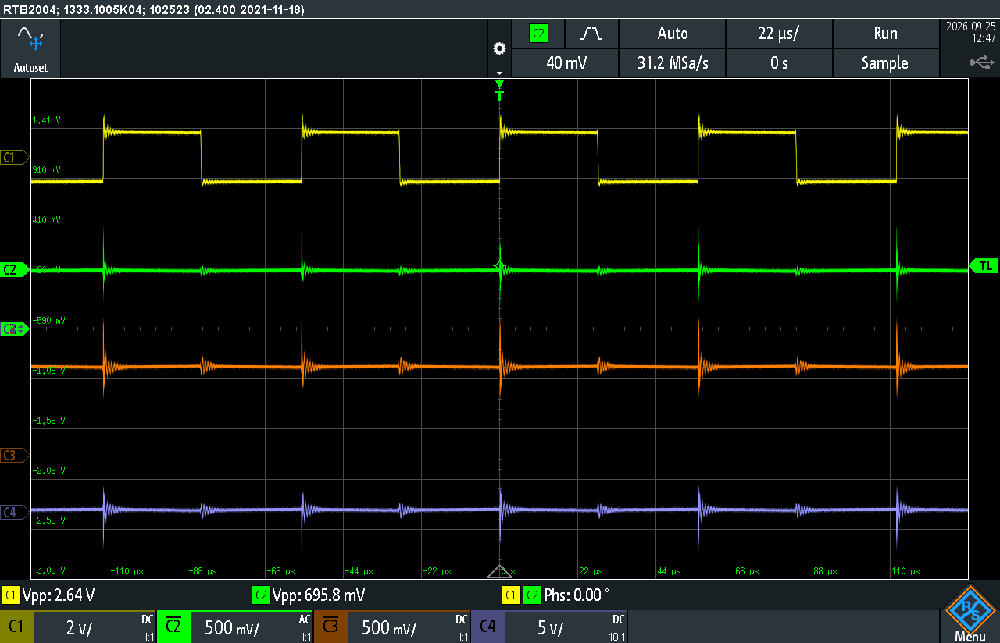
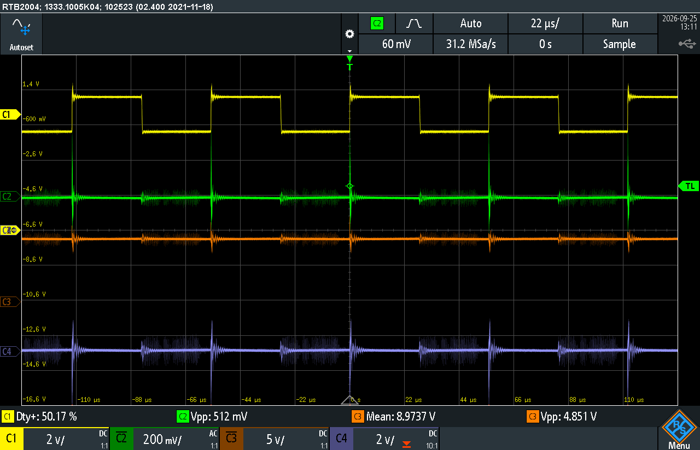
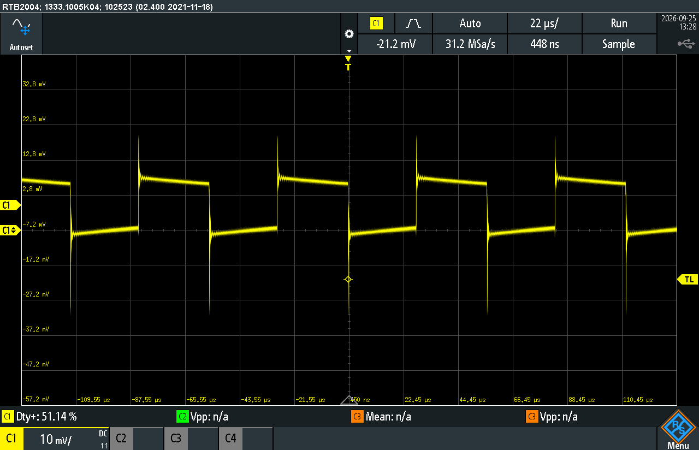
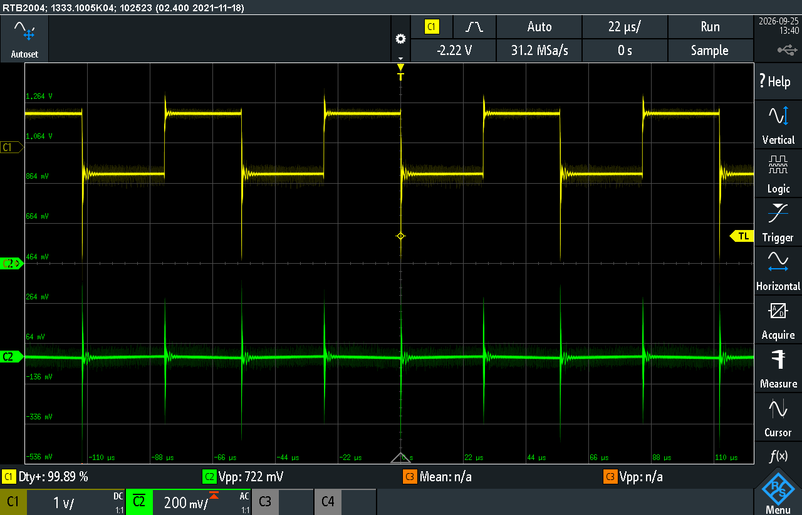
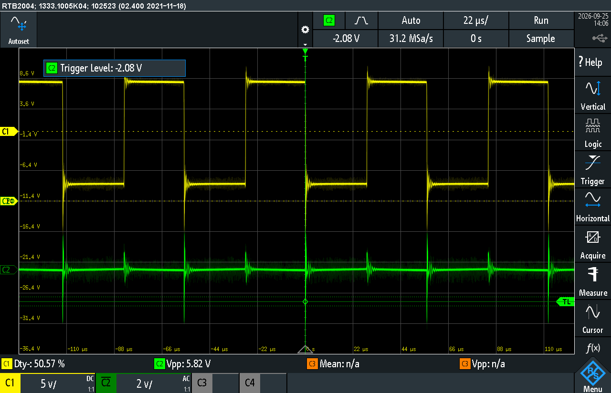
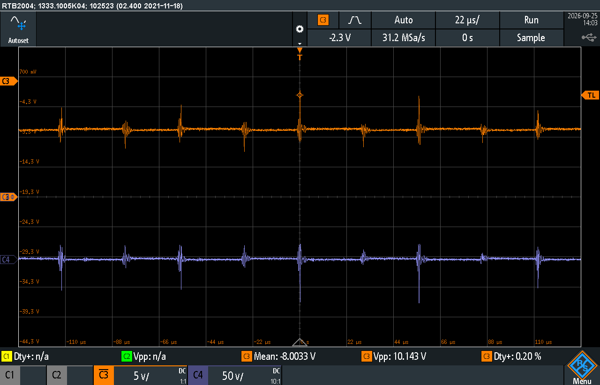
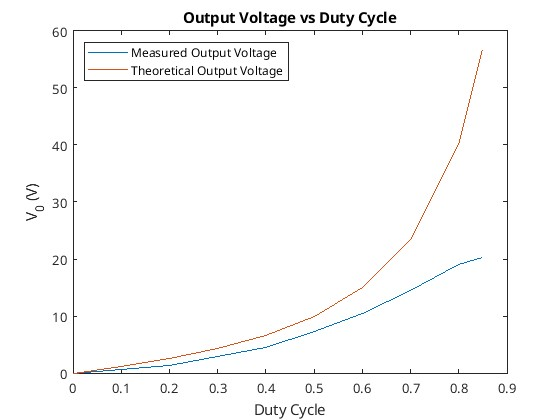

# Lab 3: DC-DC Converters

# Introduction

# Buck Converter
:NOTE: For "Part_2_Buck_50_D.png", the scope probe is on 10x, not 1x

| Duty Cycle | Input Voltage (V) | Input Current | Output Voltage | Output Current | Calculated Efficiency |
|------------|-------------------|---------------|----------------|----------------|-----------------------|
| 0          | 20                | 0             | 0              | 0.4u           | 0/0 = 0               |
| 10         | 20                | 3m            | 1.5            | 14.8m          | 0.02/0.06 = 0.33      |
| 20         | 20                | 7m            | 3.3            | 30m            | 0.10/0.14 = 0.71      |
| 30         | 20                | 15m           | 5.21           | 48m            | 0.25/0.30 = 0.83      |
| 40         | 20                | 30m           | 7              | 71m            | 0.50/0.60 = 0.83      |
| 50         | 20                | 48m           | 9.2            | 92m            | 0.85/0.96 = 0.88      |
| 60         | 20                | 69m           | 12             | 109m           | 1.31/1.38 = 0.95      |
| 70         | 20                | 94m           | 13             | 133m           | 1.73/1.88 = 0.92      |
| 80         | 20                | 120m          | 15             | 148m           | 2.22/2.40 = 0.93      |
| 85         | 20                | 137m          | 16             | 158m           | 2.53/2.74 = 0.92      |

### Voltage Ripple
V_pp/V_out = 3.4V/3.7V = 0.92

### 2 Inductors
V_pp/V_out 3.1V/3.7V = 0.84

## Why are 1 ohm resistors placed in series with the capacitor and inductor in this circuit when it is constructed?
1 Ohm resistors were placed in series with the capacitor and inductor because it would allow the oscilloscope to measure the current. Using Ohms law it can be seen that $V = IR = I$ if the resistance is $1$, hence the voltage over the resistor is equal to the current. This allows us to place the oscilloscope probes over the resistor to measure the current.

## Explain why the oscilloscope probes alligator ground clips must all be at the same point in the circuit, and why the given location in the circuit was chosen?
Oscilloscope probes ground clips are all connected together, there is a direct connection from probe 1 ground to probe 2 ground and so on. This means that if they are not connected to the sample place then a short will occur, which will effect how the circuit will function. For this circuit it was chosen that ground probe to be placed at the same node that connects the inductor, capacitor and load as it would allow us to measure the inductor voltage, inductor current, output voltage and capacitor current on oscilloscope plot. 

## Explain why the 1 ohm resistance in series with the capacitor is wired up on the other side of the capacitor for the constructed circuit?
The resistor should be closest to the common measurement point (oscilloscope ground clip). This is because the only the voltage over the 1 ohm resistor should be measured to display the current capacitor waveform. If the resistor was placed after the capacitor (the ground side), the measurement would be the capacitor voltage and the 1 ohm resistor voltage which is not equivalent to the capacitor current.

## Which channels were required to be inverted in order to display sensible / normal waveforms?
Channels 3 and 4 will need to be inverted to display positive waveforms. $V_o$ will be inverted as the positive and negative probes are inverted. $i_c$ is also inverted as the positive probe is at the negative side of the current sensing resistor.

## Plot (using recorded oscilloscope data) or include image from oscilloscope showing inductor current and voltage, output voltage and capacitor current waveforms at the duty cycle you chose to initially  operate at (40%, 50% or 60%)



## Comment on the observed waveforms and on how they change when you vary duty cycle, describing your observations by considering theory of the circuit operation and taking particular care to note whether continuous conduction is always maintained
The voltage accross the inductor followed the duty cycle, as the duty cycle was increased the amount of time the indcutor voltage was non-zero increased. This can be seen from the circuit diagram (maybe input figure of the buck converter + seen in Figure N), when the MOSFET is on the voltage across the inductor is equal to the input voltage, and when the MOSFET is off the inductor voltage is zero. As the duty cycle was varied the output voltage varied with it, increasing the duty cycle increased the output voltage and vice versa for decreasing the duty cycle. This can easily be seen to be correct by looking at the equation $V_o = DV_d$, the output voltage is directly proportional to the duty cycle. :TODO: Talk about continuous conduction

## Calculate the minimum switching frequency required to ensure continuous conduction is maintained when an output of about 4 V (20% duty cycle) is required. Compare with your observations.
For a 20% duty cycle the minimum required frequency can be calculated, as seen in the following.
\begin{align*}
L_{\min} &= \frac{(1-D)R}{2f_s} \\
\Rightarrow f_s &= \frac{(1-D)R}{2L_{\min}} \\
f_s &= \frac{(1-0.2)100}{2\cdot 3\times10^{-3}} \\
f_s &= 13.3\ kHz
\end{align*}
The acquired frequency is $13.3\ kHz$, which is close to the approximate frequency used of $15\ kHz$, so it would be expected that the efficiency is particularly bad for some duty cycle close to 20% as the buck converter would enter DCM. It can be seen in Table (:TODO: reference first table) that the efficiency is very low for a 10% duty cycle and moderately low for a 20% duty cycle, this means that the converter must have entered DCM at point between 10% and 20% duty cycle.
## From your measured data, create a plot of dc output voltage versus duty cycle. Include on the same plot the theoretical curve for a Buck Converter. Discuss briefly.

```octave 
clc
clear
close all;

if exist('OCTAVE_VERSION', 'builtin')
  set(0, "DefaultLineLineWidth", 2);
  set(0, "DefaultAxesFontSize", 25);
  warning('off');
end

V_d = 20;

D = [0, 10, 20, 30, 40, 50, 60, 70, 80, 85];
V_out = [0, 150e-3*10, 330e-3*10, 521e-3*10, 700e-3*10, 920e-3*10, 1.2*10, 1.3*10, 1.5*10, 1.6*10];

D_theo = 0:0.1:85;
V_out_theo = V_d*D_theo/100;

figure;
hold on;
plot(D, V_out);
plot(D_theo, V_out_theo);

legend("Measured", "Theoretical");
xlabel("%Duty cycle")
ylabel("Output Voltage (V)")
title("Duty Cycle vs Output Voltage Buck Converter")

#print -dpng 'ENG306_D_vs_Vout_Buck.png'
```
:TODO: Run code with print un-commented and add Figure
A output voltage versus duty cycle plot can be seen in Figure :TODO:, it contains both measured and theoretical results. The theoretical plot was obtained by applying duty cycles ranging from 0% to 100% to the equation $V_o = V_dD$. It can be seen that the measured plot closely follows the theory, there is a noticeable constant negative drop for the measured values which is mainly due to losses in the MOSFET and diode as the theory does not account for this.

## From your measurements of peak-to-peak output voltage at 20% duty cycle, calculate the % output voltage ripple and compare with theoretical calculations for your circuit if operated at the same duty    cycle.
:TODO: Something is clearly wrong here
The voltage ripple at 20% duty cycle was measured to be:
\[\frac{V_{pp}}{V_{out}} = \frac{3.4V}{3.7V} = 0.92\]
Comparing to the theoretical value:
\begin{align*}
\frac{\Delta V_o}{V_o} &= \frac{1}{8}\frac{T_s^2(1-D)}{LC} \\
\frac{\Delta V_o}{V_o} &= \frac{1}{8}\frac{\left(15\times10^3\right)^2(1-0.2)}{3\times10^{-3}\cdot100\times10^{-6}}
\frac{\Delta V_o}{V_o} &= 0.00148
\end{align*}


## What did you observe when you altered your inductance value? How do the waveforms change? Comment on how it did or might impact the conditions for the boundary between continuous and discontinuous conduction.

When doubling the inductance it was noticed that :TODO:

## Assuming you did not actually know the value of the inductor used in your Buck Converter circuit, devise a method for accurately calculating its value (for either single inductance case, or for two     placed either in series or parallel) from the observations and measurements. {Hint: consider the inductor current waveform carefully and take appropriate measurements}

# Boost Converter
| Duty Cycle | Input Voltage (V) | Input Current | Output Voltage | Output Current | Calculated Efficiency |
|------------|-------------------|---------------|----------------|----------------|-----------------------|
| 0          | 10                | 87m           | 8.7            | 87m            | 0.87                  |
| 10         | 10                | 111m          | 9.6            | 96m            | 0.83                  |
| 20         | 10                | 140m          | 10.8           | 108m           | 0.83                  |
| 30         | 10                | 167m          | 11.7           | 117m           | 0.81                  |
| 40         | 10                | 233m          | 13.6           | 136m           | 0.79                  |
| 50         | 10                | 325m          | 15.7           | 157m           | 0.75                  |
| 60         | 10                | 438m          | 17.8           | 178m           | 0.72                  |
| 70         | 10                | 773m          | 21.8           | 219m           | 0.61                  |
| 80         | 10                | 1.26          | 24.6           | 247m           | 0.48                  |
| 85         | 10                | 1.6           | 24.8           | 249m           | 0.38                  |

## Plot (using recorded oscilloscope data) or include image from oscilloscope showing inductor current and voltage, and capacitor current waveforms at the duty cycle you chose to initially operate at (40%,50% or 60%)



## Comment on the inductor waveforms and on how they changed with duty cycle, describing your observations by considering the theory of circuit operation
The inductor waveform for the boost converter is the same as the one for the buck converter. Increasing the duty cycle changes the on time and off time for the inductor voltage and the width of the triangles in the inductor current. It can slightly be seen in Figure :TODO: that the inductor current exhibits the expected triangular waveform, although the magnitude is small. It appears that the inductor is discharging for positive inductor voltages, however this is due to measuring the negative of the current which means that it the inductor is storing energy for positive voltages and releasing it for negative voltages, this aligns with the theory.

## Calculate the minimum switching frequency required to ensure continuous conduction is maintained for the whole range of circuit operation (duty cycles). How does this relate to your observations at the conditions you operated the circuit under?
Using the following equation the plot in Figure :TODO: can be made. It relates the duty cycle to minimum required frequency, we can then take the maximum value and that will be the minimum required frequency for all duty cycles. Looking at the plot it can be seen that the maximum is $2468.9\ Hz$.
\begin{align*}
f_s &= \frac{D(1 - D)^2R}{2L_min}
f_s &= \frac{D(1 - D)^2100}{2\cdot3\times10^{-3}}
\end{align*}
```{octave}
clc
clear
close all;

if exist('OCTAVE_VERSION', 'builtin')
  set(0, "DefaultLineLineWidth", 2);
  set(0, "DefaultAxesFontSize", 25);
  warning('off');
end

D = 0:0.01:1; % Define the range for D
f_s = (D .* (1 - D).^2 .* 100) / (2 * 3e-3); % Calculate f_s

% Find the maximum value and its index
[max_value, max_index] = max(f_s);
max_D = D(max_index);

% Plot the function
figure;
plot(D, f_s, 'b-', 'LineWidth', 2); % Plot f_s
hold on;

% Highlight the maximum point
plot(max_D, max_value, 'ro', 'MarkerSize', 10, 'MarkerFaceColor', 'r'); % Red circle at max
text(max_D - 0.05, max_value - 50, sprintf(' Max: %.2f', max_value), 'VerticalAlignment', 'top', 'HorizontalAlignment', 'left', 'FontSize', 25);


% Add labels and title
xlabel('D');
ylabel('f_s');
title('Plot of f_s vs D');
grid on;
hold off;
```

## From your measured data, create a plot of dc output voltage versus duty cycle. Include on the same plot the theoretical curve for a Boost Converter and compare, discussing any differences between       measured and observed.
```{octave}
clc
clear
close all;

if exist('OCTAVE_VERSION', 'builtin')
  set(0, "DefaultLineLineWidth", 2);
  set(0, "DefaultAxesFontSize", 25);
  warning('off');
end

V_d = 20;

D = [0, 10, 20, 30, 40, 50, 60, 70, 80, 85];
V_out = [8.7 9.6 10.8 11.7 13.6 15.7 17.8 21.8 24.6 24.8];

D_theo = 0:0.1:85;
V_out_theo = V_d./(1 - D_theo/100);

figure;
hold on;
plot(D, V_out);
plot(D_theo, V_out_theo);

legend("Measured", "Theoretical");
xlabel("%Duty cycle")
ylabel("Output Voltage (V)")
title("Duty Cycle vs Output Voltage Measured And Theoretical For Boost Converter")

#print -dpng 'ENG306_D_vs_Vout_Boost.png'
```
:TODO: Include plot + caption


# Buck-Boost Converter
| Duty Cycle | Input Voltage | Input Current | Output Voltage | Output Current | Calculated Efficiency |
|------------|---------------|---------------|----------------|----------------|-----------------------|
| 0          | 10            | 0             | 0              | 75u            | 0/0=0                 |
| 10         | 10            | 1m            | 0.6            | 6m             | 0.004/0.010 = 0.4     |
| 20         | 10            | 4m            | 1.4            | 14m            | 0.020/0.004 = 0.5     |
| 30         | 10            | 14m           | 2.9            | 29m            | 0.084/0.140 = 0.6     |
| 40         | 10            | 36m           | 4.5            | 46m            | 0.207/0.360 = 0.58    |
| 50         | 10            | 80m           | 7.3            | 74m            | 0.540/0.800 = 0.68    |
| 60         | 10            | 170m          | 10.5           | 106m           | 1.113/1.700 = 0.65    |
| 70         | 10            | 356m          | 14.4           | 145m           | 2.088/3.560 = 0.59    |
| 80         | 10            | 827m          | 19.0           | 191m           | 3.629/8.270 = 0.44    |
| 85         | 10            | 1.3           | 20.2           | 203m           | 4.101/13.00 = 0.32    |

## Plot (using recorded oscilloscope data) or include image from oscilloscope showing inductor current and voltage, and output voltage and capacitor current waveforms at the 50% duty cycle initially       operated at.
#TODO add figure labels




## How does the output voltage compare to theoretical output at 50% duty cycle?
The measured output voltage at 50% duty cycle is -7.3V. To calculate a theoretical value use the formula,
$$V_0=V_d\dfrac{D}{1-D}=-10V$$
This error is likely caused by losses in the buck-boost converter. Sources of losses are discussed further in the later section. 

## From your measured data, create a plot of dc output voltage versus duty cycle. Include on the same plot the theoretical curve for a Buck-Boost Converter and compare, discussing any differences between  measured and observed
#TODO add the octave code to generate the plot. Its written in the matlab file "Buck_Boost_Vo.m"

The plot of output voltage versus duty cycle (#TODO add figure refrence) shows noticeable difference between the theoretical curve and the measured value. While both curves follow the expected nonlinear trend of the buck-boost converter, the measured output is consistently lower than the theoretical curve across the full duty cycle range. This shows that whilst the theoretical curve correctly describes the relationship between duty cycle and output voltage, real converter operation is affected by component non-idealities and practical losses. Sources of potential circuit loss are further detailed in the section below (#TODO maybe add refrence to other section if we want to). This difference shows the importance of reviewing converter efficiency, as well as demonstrating issues in theoretical assumptions.
## List all the sources of loss in the Buck-Boost converter, indicating whether you think they increase or decrease (and why) as duty cycle is varied? Relate this to your observed and calculated converter efficiency values.
1) Conduction Losses
When the switch is on current flows through the MOSFET channel resistance $R_{DS(on)}$ causing $I^2R$ losses. At higher duty cycles the switch conducts for longer so the conduction losses increase.
When the switch is off current flows through the diode and energy is lost across its forward voltage. As duty cycle increases and the switch is on for longer the diode conducts for less time, lowering the forward voltage losses.
The inductor winding has resistance $R_L$ causing $I^2R$ losses proportional to the average inductor current. At low duty cycles (buck mode) current is higher for step-down so losses are higher. At high duty cycles (boost mode) current stress also increases so losses rise again. Losses are minimal around the crossover duty cycle.
2) Switching Losses
Energy is lost during voltage-current overlap when switching. Switching frequency remains constant with duty cycle but average inductor current changes with duty cycle. Higher duty cycle means higher inductor current, leading to higher switching losses.
3) Inductor Core Losses
Hysteresis and Eddy Currents are caused in the inductor core by alternating flux. Loss depends on the ripple currents. At medium duty cycles ripple is large so core losses are maximised. At extreme high/low duty cycles the ripple current is smaller so losses are minimised. 
4) Capacitor ESR Losses
Capacitor Equivalent Series Resistance (ESR) causes $I_{C,ripple}^2R$ heating. Ripple current depends on load and duty cycle. Near 50% duty cycle ripple is highest, so ESR losses increase.
5) Parasitic Losses
Parasitic inductance and capacitance in wiring cause extra minor switching losses. Not strongly duty cycle dependant but worsens under higher current stress at high/low duty cycles.

Combining these sources of loss the theoretical highest efficiency duty cycle range should be around $D=0.4\leftrightarrow0.6$ where diode and switch conduction losses balance and ripple current is not too high. Comparing this theoretical efficiency to the measured efficiency provides similar results, with the peak efficiency from $D=0.3\leftrightarrow0.6$. Efficiency at extreme duty cycles are low as expected, due to high current stresses and other sources as mentioned previously.
#TODO check this looks ok when it compiles to pdf
# Reflection
